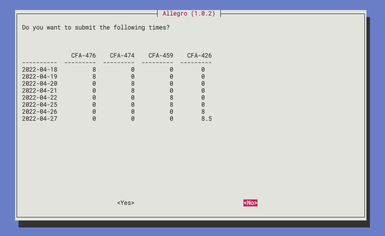

[](https://forthebadge.com)

[](https://forthebadge.com)



- [1. About Allegro](#1-about-allegro)
- [2. Installing, a.k.a. easy mode](#2-installing-aka-easy-mode)
- [3. Building from source](#3-building-from-source)
- [4. To Develop, or Run from Source](#4-to-develop-or-run-from-source)
- [5. Configuration](#5-configuration)
- [6. Newt](#6-newt)

## 1. About Allegro

> What is this thing?

This is Allegro, built to make time entry for busy developers less of a headache.
It will look for any tickets you're assigned in Jira for the currently open sprints,
ask you for any other tickets you've worked on, then it will make sure you've logged
8 hours a day to tickets, spread evenly across them.

> Does timekeeping actually take that much time?

Maybe not on a daily basis, but it can add up, certainly. Especially when you're trying
to recall what you worked on last week.

> This is ridiculous.

Thanks, I'm a ridiculous person, so that tracks.

> You're gonna break my computer, aren't you?

This isn't user-proof code. You'll need to use your years of experience and highly honed developer senses
to make sure you enter the required information correctly. **Allegro does not fail gracefully.** You will
have a chance to give final approval before it submits anything to jira, though, so you're safe
until that point.

## 2. Installing, a.k.a. easy mode

**Note:** If you've previously installed allegro, reinstalling allegro over the top of it sometimes causes
some wonkiness. I suggest you go ahead and `sudo rm -rf /usr/local/bin/allegro` before re-installing.

macOs

```
sudo curl https://raw.githubusercontent.com/JudgeSansDredd/allegro/master/dist/macos/allegro --output /usr/local/bin/allegro && sudo chmod +x /usr/local/bin/allegro
```

debian

```
sudo curl https://raw.githubusercontent.com/JudgeSansDredd/allegro/master/dist/debian/allegro --output /usr/local/bin/allegro && sudo chmod +x /usr/local/bin/allegro
```

## 3. Building from source

> Okay, I don't trust your bogus curl command, can I just build this from source?

I mean, sure. Clone the repo, and run `./build.sh`. Note that this _only_ works for Linux and Mac.
It'll put a binary at `./dist/[macos | debian]/allegro` depending on your OS.

## 4. To Develop, or Run from Source

1. _Optional:_ Create a python virtual environment, then activate it

   ```
   python3 -m venv venv
   source venv/bin/activate
   ```

2. Install python requirements

   ```
   pip3 install -r requirements.txt
   ```

3. Ready to run!
   ```
   python3 allegro.py
   ```

## 5. Configuration

> It's asking me a lot of weird questions. What's the deal?

On first run, Allegro will ask for needed configuration, such as your Jira
Access key, email address, etc. It's writing the configuration to `~/.allegro/config.ini`,
so it won't have to ask each time.

> Okay, sure, but what do these things _mean?_

- `JIRA_SERVER`: This is the domain of your Jira environment, i.e. the url you go to to
  visit Jira (e.g. `https://your-company.atlassian.net`).
- `EMAIL_ADDRESS`: This is your email address your Jira account is associated with
- `JIRA_KEY`: This can be found at https://id.atlassian.com/manage-profile/security/api-tokens.
  You may need to generate a key, if you haven't already.
- `PROJECT_KEY`: This is the letter designation in front of your Jira tickets. For
  example, if your tickets are numbered like `ABC-123`, then your `PROJECT_KEY` is `ABC`.
- `INCREMENT_SECONDS`: How granular do you want your timekeeping to be, measured in
  seconds. For example, if you want Allegro to add time to your calendar in 15 minute
  blocks, you would set your `INCREMENT_SECONDS` to `900`.
- `OVERCLOCK_CHANCE`: To add some "fuzziness" to time entry, Allegro will occasionally
  bill slightly more time to a task than is needed. `OVERCLOCK_CHANCE` represents the
  percentage chance that this occurs, e.g. `20` represents a 20% chance that a task gets
  "overclocked."
- `OVERCLOCK_RANGE`: The number of increments allowed to be overclocked. In other words,
  if Allegro decides to overclock a task (based on `OVERCLOCK_CHANCE`), it will choose a
  number of blocks between 1 and `OVERCLOCK_RANGE`, and add that many additional increments
  (based on `INCREMENT_SECONDS`) to the task.
- `PERCENT_WORKED_PER_DAY`: How much time do you spend working on tasks a day. For example,
  `50` would mean you spend half your time on tasks, and half your time on other things.
  Allegro would log approximately 4 hours of work per day.

## 6. Newt

> It's yelling at me about not having whiptail, or something

Whiptail is a bash program that allows for fancy looking GUIs. If you don't have it installed,
the fastest way to get it is by running `brew install newt`. It comes in the `newt` package.
